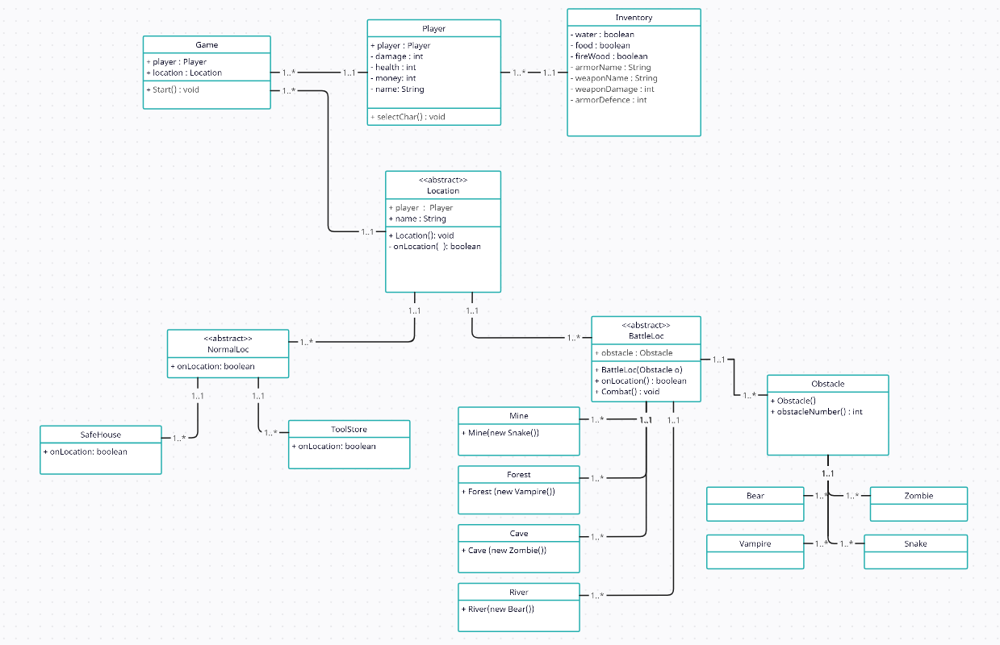

# AdventureGame
Java ile metin tabanlı bir macera oyunu. Oyunu bitirebilmek için savaş bölgelerindeki tüm düşmanlar temizlendikten sonra bölgeye özel ödülü oyunucun envanterine eklenmelidir. Eğer oyuncu tüm ödülleri toplayıp "Güvenli Eve" dönebilirse oyunu kazanır. Ayrıca ödül kazanılan bölgeye tekrar giriş yapılamaz.
Oyuncu bir canavarla karşılaştığında ilk hamleyi kimin yapacağını, %50 şans ile belirleniyor. Maden ocagı kullanıcıların 
para zirh ve silah kazandigi yerdir. Herhangi bir kısıtlama bulunmamaktadır.

##  Yılanlardan düşen ödül havuzu 

- Silah Kazanma İhtimali : 15% 
  - Tüfek Kazanma İhtimali : 20% 
  - Kılıç Kazanma İhtimali : 30% 
  - Tabanca Kazanma İhtimali : 50% 
- Zırh Kazanma İhtimali : 15% 
  - Ağır Zırh Kazanma İhtimali : 20% 
  - Orta Zırh Kazanma İhtimali : 30% 
  - Hafif Zırh Kazanma İhtimali : 50% 
- Para Kazanma İhtimali : 25% 
  - 10 Para Kazanma İhtimali: 20% 
  - 5 Para Kazanma İhtimali: 30% 
  - 1 Para Kazanma İhtimali: 50%
- Hiç birşey kazanamama ihtimali : 45%

## Karakter ve Canavar Tablosu
<table>
<tr><th>Karakterler </th><th>Canavarlar</th></tr>
<tr><td>

| Karakter | Id  | Hasar | Saglık | Para |
|----------|-----|-------|--------|------|
| Samuray  | 1   | 5     | 21     | 15   |
| Okcu     | 2   | 7     | 18     | 20   |
| Sovalye  | 3   | 8     | 24     | 5    |

</td><td>

| Karakter | Id  | Hasar | Saglık | Odul            |
|----------|-----|-------|--------|-----------------|
| Zombi    | 1   | 3     | 10     | 4  para         |
| Vampir   | 2   | 4     | 14     | 7    para       |
| Ayi      | 3   | 7     | 20     | 12    para      |
| Yilan    | 4   | 3-6   | 12     | Zırh,Silah,Para |

</td></tr> </table>

## Silah ve Zırh Tablosu
<table>
<tr><th>Silahlar </th><th>Zirhlar</th></tr>
<tr><td>

| Karakter | Id  | Hasar | Para |
|----------|-----|-------|------|
| Tabanca  | 1   | 2     | 25   |
| Kılıç    | 2   | 3     | 35   |
| Tüfek    | 3   | 7     | 45   |

</td><td>

| Karakter | Id  | Engelleme | Para |
|----------|-----|-----------|------|
| Hafif    | 1   | 1         | 15   |
| orta     | 2   | 3         | 25   |
| Ağır     | 3   | 5         | 40   |

</td></tr> </table>

## Konumlar
1. Güvenli Ev 
   1. Özellik : Can Yenileniyor

2. Mağara 
   1. Canavar : Zombi (1-3 Adet)
   2. Özellik : Savaş + Ganimet 
   3. Eşya : Yemek (Food)

3. Orman 
   1. Canavar : Vampir (1-3 Adet)
   2. Özellik : Savaş + Ganimet 
   3. Eşya : Odun (Firewood)

4. Nehir 
   1. Canavar : Ayı (1-3 Adet)
   2. Özellik : Savaş + Ganimet 
   3. Eşya : Su (Water)

5. Maden
   1. Bu bölgenin amacı yenilen rakiplerden rastgele para,
   silah veya zırh kazanma ihtimali olması.
   2. Canavar : Yılan (1-5 Adet)
   3. Özellik : Savaş ve Ganimet 
   4. Eşya : Para, Silah veya Zırh

6. Mağaza 
   1. Özellik : Destekleyici Eşyalar Satın Almak 
   2. Silah : Tabanca,Kılıç,Tüfek 
   3. Zırh : Hafif,Orta,Ağır

## UML CLASS DIAGRAM
